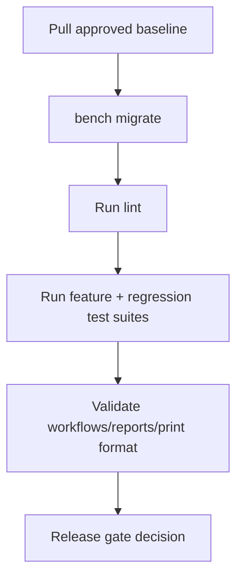

# DEPLOYMENT_GUIDE

## Purpose

Deploy the frozen Sprint 1 + Sprint 2 baseline safely.

## Preconditions

- Bench and site are healthy
- App installed on target site
- Tests enabled where required
- No unreviewed local code modifications

## Baseline Deployment Flow



## Commands

```bash
bench --site baby-dokkan.store migrate
ruff check .
bench --site baby-dokkan.store run-tests --module enterprise_intelligence_platform.enterprise_intelligence_platform.doctype.lighthouse_workflow_charter.test_lighthouse_workflow_charter
bench --site baby-dokkan.store run-tests --module enterprise_intelligence_platform.enterprise_intelligence_platform.doctype.decision_record.test_decision_record
bench --site baby-dokkan.store run-tests --module enterprise_intelligence_platform.enterprise_intelligence_platform.doctype.dependency_exception_record.test_dependency_exception_record
bench --site baby-dokkan.store run-tests --module enterprise_intelligence_platform.enterprise_intelligence_platform.report.operational_review_view.test_operational_review_view
bench --site baby-dokkan.store run-tests --module enterprise_intelligence_platform.enterprise_intelligence_platform.doctype.attribution_case.test_attribution_case
bench --site baby-dokkan.store run-tests --module enterprise_intelligence_platform.enterprise_intelligence_platform.doctype.attribution_case.test_executive_proof_snapshot
```

## Post-deploy Verification

- Workflows exist and are active for each parent DocType
- Register reports are visible to intended roles
- `Operational Review View` executes for authorized users
- `Executive Proof Snapshot` exists and renders approved attribution cases only

## Non-goals in baseline deployment

- No background job orchestration
- No API rollout dependencies
- No snapshot archival data migration
