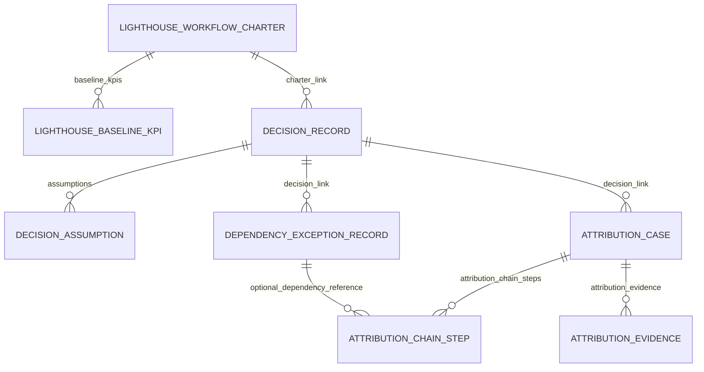
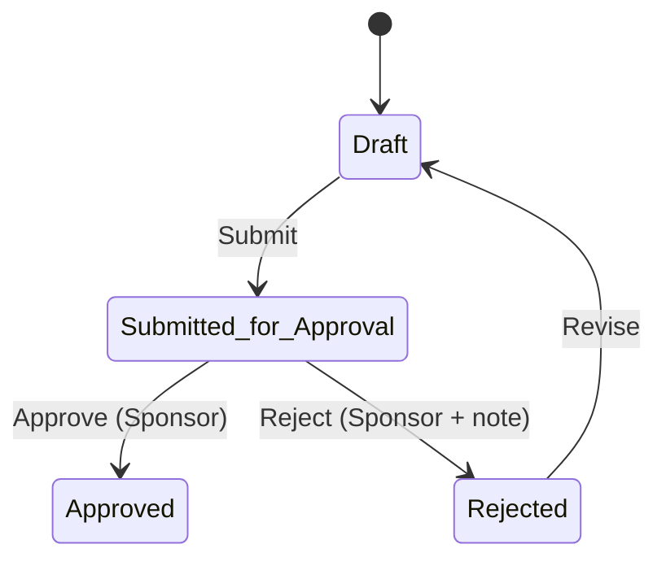

# DOMAIN_MODEL

## Purpose

This document describes the implemented domain entities and relationships in the frozen Sprint 1 + Sprint 2 baseline.

## Domain Graph (Implemented)

## Entity Summaries

### 1) Lighthouse Workflow Charter
- Root governance entity for workflow baseline accountability
- Key fields: `workflow_name`, owner/sponsor, cadence, baseline date range, `approval_state`
- Child rows: `Lighthouse Baseline KPI` with exact required KPI set

### 2) Decision Record
- Decision accountability record linked to a single charter
- Key fields: `decision_title`, owner/sponsor, criticality, dates, `approval_state`
- Child rows: `Decision Assumption`

### 3) Dependency Exception Record
- Dependency tracking + exception governance linked to a decision
- Key fields: status, criticality, dates, exception fields, `approval_state`

### 4) Attribution Case
- Attribution chain and confidence record linked to a decision
- Key fields: observation dates, summaries, `confidence_score`, `confidence_rationale`, `approval_state`
- Child rows:
  - `Attribution Chain Step` (ordered, optional dependency reference)
  - `Attribution Evidence` (supports-claim + evidence references)

## Child Table Semantics

### Lighthouse Baseline KPI
- Controlled code list: `DRR`, `DCT`, `AER`, `OCR`, `RER`
- Contains numeric baseline values and source metadata

### Decision Assumption
- Assumption text, confidence score, falsifiability note, optional expiry

### Attribution Chain Step
- `sequence_no` + step summary
- Optional reference to `Dependency Exception Record`

### Attribution Evidence
- Evidence type and reference metadata
- `supports_claim` stored as Check but normalized in server-side validation

## Referential Integrity (Implemented)

- Decision sponsor must match linked charter sponsor
- Dependency sponsor/charter must match linked decision
- Attribution sponsor/charter must match linked decision
- Attribution chain dependency reference must belong to same decision as attribution case

## Lifecycle Model by Domain Entity

> Note: `Lighthouse Workflow Charter` uses `Submitted for Sponsor Approval`, `Baseline Accepted`, `Baseline Rejected` labels, but follows the same four-phase governance pattern.

## Deferred / Not in baseline

- No cross-tenant modeling
- No event bus projections
- No external integration-specific domain objects
- No persisted snapshot entity for Executive Proof Snapshot
