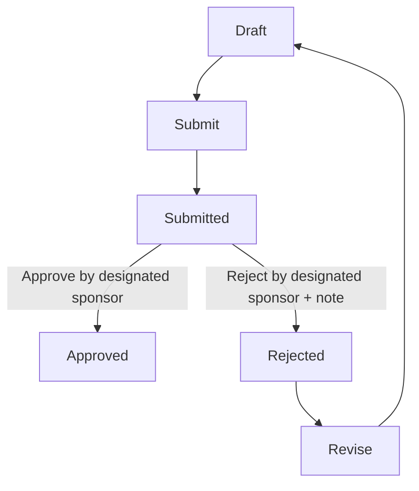

# GOVERNANCE_MODEL

## Purpose

This document captures implemented governance controls in the frozen baseline.

## Governance Principles (Implemented)

1. **Workflow-first state governance** on all parent entities
2. **Controller-level rule enforcement** in `validate()`
3. **Sponsor accountability** for approval/rejection
4. **Approved-record immutability** for non-`System Manager`
5. **Server-side validation authority** (not client-only)

## Role Model

- `EIP Workflow Owner`
- `EIP Executive Sponsor`
- `EIP Operations Manager`
- `System Manager`

## Workflow Topology

## Implemented Workflow Definitions

- `Lighthouse Workflow Charter Approval`
- `Decision Record Approval`
- `Dependency Exception Record Approval`
- `Attribution Case Approval`

All are provisioned by post-model-sync patches and set `workflow_state_field = approval_state`.

## Governance Controls by Entity

### Lighthouse Workflow Charter
- Exact KPI set enforcement (`DRR`, `DCT`, `AER`, `OCR`, `RER`)
- Baseline date-range validation
- Sponsor-only acceptance/rejection
- Acceptance metadata: `baseline_accepted_by`, `baseline_accepted_on`

### Decision Record
- Charter sponsor linkage integrity
- Assumption presence + uniqueness + confidence score bounds
- Sponsor-only approve/reject
- Approval metadata: `approved_by`, `approved_on`

### Dependency Exception Record
- Linked decision integrity (sponsor + charter)
- Dependency/exception date and status rules
- Exception-required field completeness
- Sponsor-only approve/reject
- Approval metadata: `approved_by`, `approved_on`

### Attribution Case
- Linked decision integrity (sponsor + charter)
- Observation date and confidence bounds
- Chain-step and evidence-row integrity
- `supports_claim` normalization + validation
- Sponsor-only approve/reject
- Approval metadata: `approved_by`, `approved_on`

## Governance Artifacts Added in Sprint 2

- `Operational Review View` (cross-record operational visibility)
- `Executive Proof Snapshot` (approved attribution-only print render)

## Deferred Governance Concerns

- Print-format dependency lookup optimization (accepted non-blocking debt)
- No additional governance controls beyond Sprint 1 + Sprint 2 contracts
