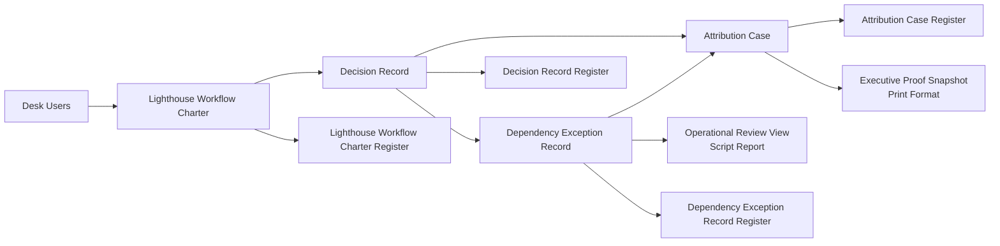

# SYSTEM_ARCHITECTURE

## Purpose

This document describes the **implemented** system architecture for the frozen Sprint 1 + Sprint 2 baseline of `enterprise_intelligence_platform`.

## Scope (Implemented)

- Frappe-native document workflows for:
  - `Lighthouse Workflow Charter`
  - `Decision Record`
  - `Dependency Exception Record`
  - `Attribution Case`
- Register reports (Report Builder) for each governed parent DocType
- Script report: `Operational Review View`
- Print format: `Executive Proof Snapshot` for `Attribution Case`
- Post-model-sync patch strategy for roles/workflows/print format provisioning

## High-level Architecture

## Runtime Layers

1. **DocType schema layer** (`*.json`)
   - Field model, permissions, naming series, child-table structure
2. **Controller validation layer** (`*.py`)
   - State integrity, linkage validation, rule enforcement, metadata stamping
3. **Workflow layer** (provisioned by post-model-sync patches)
   - State machine transitions and role-conditional workflow gating
4. **Reporting/Rendering layer**
   - Register reports, script report, print format
5. **Migration/Provisioning layer** (`patches.txt` + patch modules)
   - Idempotent setup of roles, workflow states/actions/workflows, print format

## Implemented Artifacts

### Parent DocTypes
- `Lighthouse Workflow Charter`
- `Decision Record`
- `Dependency Exception Record`
- `Attribution Case`

### Child DocTypes
- `Lighthouse Baseline KPI`
- `Decision Assumption`
- `Attribution Chain Step`
- `Attribution Evidence`

### Workflows
- `Lighthouse Workflow Charter Approval`
- `Decision Record Approval`
- `Dependency Exception Record Approval`
- `Attribution Case Approval`

### Reports / Print Format
- `Lighthouse Workflow Charter Register` (Report Builder)
- `Decision Record Register` (Report Builder)
- `Dependency Exception Record Register` (Report Builder)
- `Attribution Case Register` (Report Builder)
- `Operational Review View` (Script Report)
- `Executive Proof Snapshot` (Print Format via patch)

## Implemented Security & Permissions

All four parent DocTypes and all reports are role-scoped to:
- `System Manager`
- `EIP Workflow Owner`
- `EIP Executive Sponsor`
- `EIP Operations Manager`

Write access is limited by DocType permissions + workflow/controller checks.

## What is explicitly not implemented

- No custom REST APIs for Sprint 1–2 features
- No background jobs for Sprint 1–2 features
- No additional persistence for Feature 3 snapshots
- No client-script business-rule enforcement (server-side/controller-first)

## Baseline Contract

Sprint 1 + Sprint 2 are frozen baseline. Future changes must be additive/backward-compatible unless justified by:
1. reproducible production defect, or
2. approved architecture decision.
