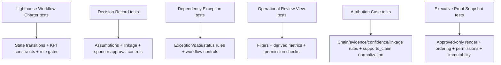

# TESTING_GUIDE

## Test Strategy (Implemented)

The baseline uses **module-level behavior tests** with `FrappeTestCase` and deterministic fixture builders.

### Core principles
- Validate controller invariants through insert/save paths
- Validate workflow transitions and rejection-note rules
- Validate role permissions (`PermissionError` paths)
- Validate report outputs and derived fields
- Validate print-render gating and content sections

## Test Modules

### Sprint 1
- `doctype/lighthouse_workflow_charter/test_lighthouse_workflow_charter.py`
- `doctype/decision_record/test_decision_record.py`
- `doctype/dependency_exception_record/test_dependency_exception_record.py`

### Sprint 2
- `report/operational_review_view/test_operational_review_view.py`
- `doctype/attribution_case/test_attribution_case.py`
- `doctype/attribution_case/test_executive_proof_snapshot.py`

## Coverage Map



## Running Tests

Use site-scoped module execution:

```bash
bench --site baby-dokkan.store run-tests --module <python.module.path>
```

Recommended order for full baseline regression:
1. Lighthouse Workflow Charter
2. Decision Record
3. Dependency Exception Record
4. Operational Review View
5. Attribution Case
6. Executive Proof Snapshot

## Notes on Environment Variance

Some workflow tests skip native `apply_workflow` assertions when monkey patches override core workflow functions in environment.

This is expected and explicitly handled in tests.

## Minimum quality gate

- `ruff check .` passes
- `bench migrate` passes
- Modified feature suite passes
- Frozen baseline suites pass
