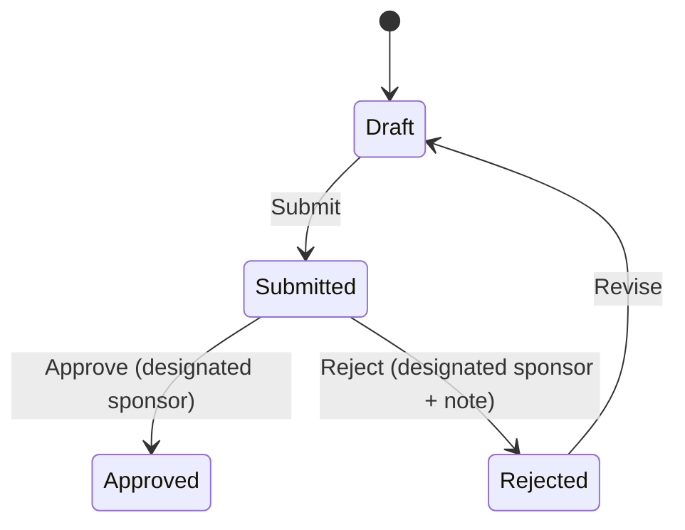

# WORKFLOW_GUIDE

## Implemented Workflows

Provisioned by post-model-sync patches:
- `Lighthouse Workflow Charter Approval`
- `Decision Record Approval`
- `Dependency Exception Record Approval`
- `Attribution Case Approval`

## Common Workflow Pattern

## Workflow Labels by Entity

- **Lighthouse Workflow Charter**
  - `Draft`
  - `Submitted for Sponsor Approval`
  - `Baseline Accepted`
  - `Baseline Rejected`

- **Decision Record / Dependency Exception Record / Attribution Case**
  - `Draft`
  - `Submitted for Approval`
  - `Approved`
  - `Rejected`

## Transition Guards (Implemented)

- Approve/reject transitions are sponsor-gated through:
  - workflow transition conditions (`doc.executive_sponsor == frappe.session.user`)
  - controller checks for state changes to sponsor states
- Rejection requires note fields:
  - Charter: `sponsor_decision_note`
  - Decision: `decision_note`
  - Dependency: `sponsor_decision_note`
  - Attribution: `sponsor_decision_note`

## Immutability Rule

When records are approved/accepted, non-`System Manager` users cannot mutate them.

## Workflow Provisioning Mechanics

Each workflow patch:
1. Ensures roles exist
2. Ensures workflow states exist
3. Ensures workflow actions exist
4. Creates/updates workflow states and transitions idempotently
5. Deactivates other workflows for same target DocType

## Operational Notes

- State field is always `approval_state`
- All configured states use `doc_status = 0`
- Native `apply_workflow` checks in tests are conditionally skipped when environment monkey patches override workflow internals
