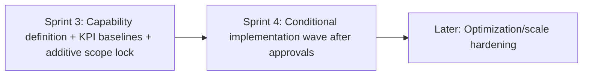

# SPRINT_3_ARCHITECTURE_REVIEW

Date: 2026-07-29  
Scope reviewed: `docs/implementation/SPRINT_3_PLANNING_BRIEF.md`  
Review mode: Critical architecture challenge (planning-only, no implementation)

---

## Review Method

This review evaluates Sprint 3 planning claims against frozen baseline documentation:
- `docs/SYSTEM_ARCHITECTURE.md`
- `docs/DOMAIN_MODEL.md`
- `docs/GOVERNANCE_MODEL.md`
- `docs/implementation/SPRINT_2_COMPLETION_PACKAGE.md`

Tagging policy:
- **[Fact]** = directly documented in current project docs
- **[Inference]** = logical conclusion from documented facts
- **[Recommendation]** = reviewer proposal/judgment

---

## Baseline-Conformance Assessment

### 1) Additive compatibility with frozen Sprint 1 + Sprint 2 baseline
- **[Fact]** Planning brief explicitly states planning-only scope and ADR trigger conditions before baseline changes.
- **[Inference]** Current brief does not directly modify frozen contracts, because it proposes capability direction rather than implementation artifacts.
- **[Recommendation]** Preserve this by forbidding Sprint 3 backlog items that include baseline contract edits before ADR approval.

### 2) Alignment with documented architecture
- **[Fact]** Existing architecture is governance-centric with four parent DocTypes, approval workflows, register/script reporting, and executive print rendering.
- **[Inference]** A “follow-through management” capability can align if it layers on existing governance entities rather than redefining them.
- **[Recommendation]** Require explicit traceability from every future Sprint 3 requirement to one baseline artifact (DocType/workflow/report/print/patch) before backlog creation.

### 3) Measurable business value quality
- **[Fact]** Planning brief defines KPI categories and target directions.
- **[Fact]** It also states baseline absolute values are not yet confirmed.
- **[Inference]** Value case is currently directional, not decision-grade.
- **[Recommendation]** Treat KPI baseline quantification as a blocker for backlog creation approval.

---

## Assumption Challenge (Strict)

## Assumption A: “Executive Decision Follow-Through Management” is the highest priority
- **[Fact]** No comparative candidate list with quantified scoring appears in the brief.
- **[Inference]** Priority claim is currently asserted, not evidenced.
- **[Recommendation]** Add a scored alternatives table (impact, effort, risk, strategic fit) before approving backlog creation.

## Assumption B: Existing artifacts are under-leveraged
- **[Fact]** Baseline has reports, workflows, and print format implemented and tested.
- **[Fact]** Brief cites likely manual workarounds but does not provide measured prevalence.
- **[Inference]** Under-leverage is plausible but unproven.
- **[Recommendation]** Confirm with usage telemetry and sponsor/owner workflow analysis before committing scope.

## Assumption C: Capability is likely additive
- **[Fact]** Brief says baseline-modifying need is “not yet proven.”
- **[Inference]** Because follow-through often introduces new action lifecycle semantics, collision risk with frozen workflow semantics is non-trivial.
- **[Recommendation]** Pre-define non-negotiable boundary: no changes to existing `approval_state` state machines in Sprint 3 unless ADR approved.

## Assumption D: KPI set is sufficient for success gating
- **[Fact]** KPI categories are listed (ROI proxy, latency, effort, governance, confidence, adoption).
- **[Fact]** No exact target thresholds are approved.
- **[Inference]** Success criteria are not yet operationally measurable.
- **[Recommendation]** Define numeric entry/exit thresholds before backlog creation.

---

## Capability-Level Review

The planning brief proposes one capability family.

## Capability 1: Executive Decision Follow-Through Management

### Business problem solved
- **[Fact]** Baseline documents governance capture/approval and visibility artifacts.
- **[Inference]** Gap is in action orchestration and measurable follow-through loop across existing artifacts.

### Expected business value
- **[Recommendation]** Reduce decision-to-resolution latency, reduce manual coordination effort, improve sponsor confidence in execution reliability.

### Primary users
- **[Fact]** Baseline roles: `EIP Executive Sponsor`, `EIP Workflow Owner`, `EIP Operations Manager`, `System Manager`.
- **[Inference]** Primary operational users are sponsor + owner; operations manager likely secondary.

### Dependencies
- **[Fact]** Internal: Charter, Decision, Dependency, Attribution, Operational Review View, Executive Proof Snapshot.
- **[Fact]** External: Frappe/ERPNext runtime environment.
- **[Inference]** Practical dependency also includes telemetry availability for KPI baselining (not yet documented as implemented telemetry system).

### Risks
- **[Fact]** Brief includes risks around KPI movement, contract changes, measurement noise, scope creep.
- **[Inference]** Highest architecture risk is accidental baseline workflow/permission drift during “follow-through” design.

### KPIs
- **[Fact]** KPI categories are specified with target directions.
- **[Recommendation]** Convert each KPI to numeric baseline and target band before sprint scoping.

### ADR requirement
- **[Fact]** Brief defines ADR triggers (state semantics, immutability/approval relaxation, permission redefinition, duplicate persistence).
- **[Inference]** ADR is conditionally required; not mandatory yet.
- **[Recommendation]** Declare “ADR likely” if any candidate requirement introduces a new action lifecycle state beyond existing entities.

### Frozen baseline change required?
- **[Fact]** Not established yet.
- **[Inference]** Could remain additive if capability uses existing entities and additive surfaces only.
- **[Recommendation]** Keep as additive unless approved ADR says otherwise.

---

## Duplication / Complexity / Governance / Security Check

### Potential duplication concerns
- **[Fact]** Baseline already includes operational visibility (`Operational Review View`) and executive evidence (`Executive Proof Snapshot`).
- **[Inference]** Sprint 3 risks duplicating these if it adds parallel “status” or “proof” channels without clear differentiation.
- **[Recommendation]** Require explicit differentiation statement: “what Sprint 3 adds that existing report/print artifacts do not.”

### Unnecessary complexity risks
- **[Inference]** Introducing a new follow-through lifecycle could unintentionally replicate existing approval-state machinery.
- **[Recommendation]** Prefer capability definitions that compose existing states/signals first, before introducing new lifecycle constructs.

### Governance/security risks
- **[Fact]** Frozen baseline governance relies on sponsor-gated transitions, note requirements, and approved immutability.
- **[Inference]** Any Sprint 3 convenience shortcuts (bulk transitions, implicit approvals, privileged overlays) would weaken governance.
- **[Recommendation]** Add explicit “no governance downgrade” constraint in Sprint 3 backlog gate.

### Frappe best-practice alignment
- **[Fact]** Current baseline patterns: controller validation + native workflows + patch provisioning + role-scoped artifacts.
- **[Inference]** Planning brief is compatible with these patterns but does not yet bind future scope to them.
- **[Recommendation]** Add mandatory architectural pattern clause to backlog gate: no bypass of existing validation/permission/workflow model without ADR.

---

## Missing Information (must be explicit)

1. **[Fact]** No quantified baseline KPI values provided.
2. **[Fact]** No candidate capability comparison matrix provided (for “highest priority” claim).
3. **[Fact]** No target threshold values for success/failure provided.
4. **[Fact]** No explicit statement of data collection mechanism for KPI instrumentation in current docs.
5. **[Fact]** No explicit “definition of done” for backlog creation itself (separate from sprint exit).

**[Recommendation]** These gaps should be closed before Sprint 3 backlog creation approval.

---

## Priority Order (Impact vs Effort)

Because only one capability family is proposed, prioritization is phased by readiness depth.

### Priority 1 (highest business impact / lowest architecture risk)
1. **KPI baseline quantification and instrumentation agreement**
   - **[Recommendation]** Complete before backlog creation.

### Priority 2
2. **Capability scope decomposition and non-duplication proof**
   - **[Recommendation]** Show exact delta from Operational Review View + Executive Proof Snapshot.

### Priority 3
3. **ADR gate decision (if needed)**
   - **[Recommendation]** Trigger immediately if any requirement touches frozen workflow/permission/immutability contracts.

---

## Phased Roadmap Recommendation

### Sprint 3 (planning and architecture phase)
- **[Recommendation]** Finalize measurable problem statement, KPI baselines, non-duplication boundaries, ADR necessity.

### Sprint 4 (implementation phase, conditional)
- **[Recommendation]** Only after approvals; implement additive scope that does not alter frozen contracts unless ADR approved.

### Later
- **[Recommendation]** Scale/performance refinements and optional governance extensions based on pilot evidence.

---

## Capability Matrix (Requested structured view)

| Capability | Business Problem | Value | Users | Dependencies | Risks | KPIs | ADR Required? | Baseline Change? |
|---|---|---|---|---|---|---|---|---|
| Executive Decision Follow-Through Management | Manual/fragmented cross-record follow-through orchestration | Lower latency, lower manual effort, better governance confidence | Sponsor, Workflow Owner, Ops Manager | Charter/Decision/Dependency/Attribution + ORV + EPS + Frappe runtime | KPI uncertainty, scope creep, baseline drift risk | ROI proxy, latency, manual effort, governance, confidence, adoption | Conditional (trigger-based) | Not yet proven; should remain additive by default |

Legend: values above are **[Inference]** + **[Recommendation]** unless explicitly documented as **[Fact]** in baseline docs.

---

## Blocking Issues

1. **Unproven prioritization claim**  
   - “Highest priority” is not supported by documented comparative scoring.
2. **No quantified KPI baselines or target thresholds**  
   - Success cannot be objectively measured yet.
3. **ADR conditionality unresolved**  
   - Additive assumption is plausible but not locked against specific capability requirements.

---

## Non-blocking Observations

1. Fact/Recommendation tagging in planning brief is generally good.
2. Domain impact section is directionally aligned with baseline architecture.
3. Risk register includes appropriate governance-related concerns.
4. Readiness/exit checklists are useful but need numeric KPI precision.

---

## ADRs Required

**Current state:** No ADR is automatically required yet.  
**Conditional requirement:** ADR becomes required if Sprint 3 scope includes any of:
- workflow-state semantic changes,
- immutability/approval-policy relaxation,
- permission model redefinition,
- duplicate persistence/source-of-truth constructs.

---

## Recommended Sprint 3 Scope

Planning-only scope to approve now:
1. Quantify baseline KPI values and target thresholds.
2. Produce a comparative capability prioritization matrix.
3. Define explicit non-duplication boundaries vs current ORV/EPS artifacts.
4. Determine ADR necessity with concrete requirement statements.

Not recommended yet:
- Any implementation scope or backlog item that implies baseline contract modification without ADR.

---

## Deferred Items

1. Implementation architecture and delivery sequencing (defer to post-approval stage).
2. Scale/performance optimizations beyond planning KPI instrumentation.
3. Any baseline-modifying governance changes pending ADR.

---

## Overall Architecture Score (/10)

**6.8 / 10**

Rationale:
- Strong directional alignment and governance awareness.
- Insufficient quantitative grounding and priority proof for backlog-ready approval.

---

## Final Recommendation

**REQUEST CHANGES**

The planning brief should be revised to include quantified KPI baselines/targets, explicit capability prioritization evidence, and a concrete ADR decision checkpoint before Sprint 3 backlog creation is approved.
