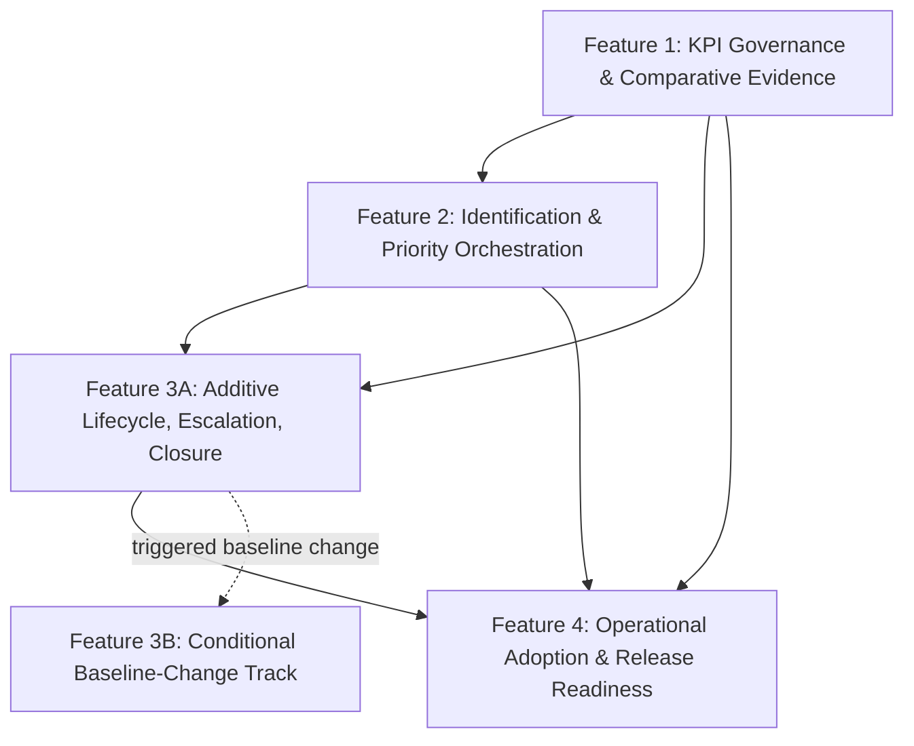

> **Status: Implementation Planning Only**
>
> Approved source set (and only source set used):
> - `docs/implementation/SPRINT_3_PHASE_1_CAPABILITY_ASSESSMENT.md`
> - `docs/implementation/SPRINT_3_PHASE_1_INDEPENDENT_REVIEW.md`
> - `docs/implementation/SPRINT_3_PHASE_1_RECONCILED_DECISION.md`
> - `docs/implementation/SPRINT_3_PHASE_2_ARCHITECTURE_SPECIFICATION.md`
>
> Baseline `v0.2.0-baseline` is immutable.
> This document contains no implementation code and authorizes no runtime changes.

# SPRINT_3_PHASE_3_IMPLEMENTATION_PLAN

Date: 2026-07-29  
Scope: Sprint 3 – Phase 3 planning package for **Executive Decision Follow-Through Management**

---

## 0) Planning Intent

Define an implementation-ready planning package (without coding) for the Phase 2 architecture, with strict baseline-protection governance and measurable acceptance criteria.

---

## 0.1) Planning Governance Definitions (Normative)

- **Independently approvable planning increment**: a feature planning package that can be reviewed and approved as a planning unit, even when implementation dependencies exist.
- **Go threshold**: minimum quantitative governance threshold to proceed to implementation approval.
- **No-Go threshold**: quantitative threshold that blocks implementation approval.
- **Mandatory review band**: intermediate range requiring formal sponsor-led review before a Go/No-Go decision.
- **Fail-fast condition**: any single condition that immediately blocks implementation approval irrespective of aggregate score.

---

## 0.2) Complexity Scoring Rubric

Work package complexity is scored with five dimensions, each scored 1–5:

1. **Domain complexity**
2. **Governance complexity**
3. **Integration breadth**
4. **Testing effort (planning scope)**
5. **Baseline risk**

### Complexity bands
- **Low**: total 5–9
- **Medium**: total 10–15
- **High**: total 16–20
- **Very High**: total 21–25

---

## 0.3) KPI Governance Thresholds for Implementation Approval

These are planning-governance thresholds only.

### Evidence completeness denominator (normative)

For any active quality gate, Evidence Completeness % is calculated using the mandatory evidence items listed for that gate in Section 8.

$$
	ext{Evidence Completeness \%} = \frac{\text{Number of mandatory evidence items present and reviewable}}{\text{Total mandatory evidence items listed for the active gate in Section 8}} \times 100
$$

All reviewers must use this Section 8 denominator so the same gate package yields the same percentage.

### Measured gates

1. **KPI completeness %**
  - Definition: % of in-scope KPIs with required fields (formula, source owner, measurement window, threshold, pass/fail rule).
  - **Go:** 100%
  - **No-Go:** <100%

2. **Evidence completeness %**
  - Definition: % of mandatory evidence items present and reviewable, using the Section 8 denominator.
  - **Go:** >=95%
  - **Mandatory review band:** 90%–94.9%
  - **No-Go:** <90%

3. **Comparative score vs alternatives**
  - Definition: Candidate A weighted comparative score versus Candidate B, using approved weighted dimensions.
  - **Go:** Candidate A >= Candidate B + 10 percentage points
  - **Mandatory review band:** Candidate A between Candidate B and Candidate B + 9.9 points
  - **No-Go:** Candidate A < Candidate B

### Fail-fast conditions (immediate stop)

1. Any Baseline Change trigger is present without ADR initiation.
2. Any in-scope KPI missing formula or measurement window.
3. Any in-scope KPI missing authoritative source-of-truth mapping.
4. Comparative scoring matrix missing approved weighting model.
5. Required approver role absent for the active gate.

### Mandatory review rule

If any metric lands in the mandatory review band, adjudication must follow the deterministic algorithm below and must end with exactly one outcome: **GO** or **NO-GO**.

### Deterministic mandatory-review adjudication algorithm (binary)

Applicable when one or more measured gates are in the mandatory review band.

#### Required evidence package (all required before adjudication)
1. KPI matrix (formula, source owner, measurement window, threshold, pass/fail rule).
2. Comparative assessment matrix (Candidate A vs Candidate B) with approved weighting model.
3. Current planning risk assessment status (feature risk register disposition).
4. Architecture impact review evidence (Phase 2 conformance and contradiction check).
5. Baseline compatibility review evidence (trigger assessment status).
6. Active-gate mandatory evidence set from Section 8.

#### Approval conditions (all conditions required for GO)
1. 100% of the required evidence package above is present and reviewable.
2. KPI completeness is 100%.
3. Evidence completeness is >=90% using the Section 8 denominator.
4. Comparative score is >= Candidate B.
5. No unresolved **High** or **Critical** findings remain in the current planning findings/risk set.
6. No unresolved Baseline Change trigger exists for additive implementation scope.
7. Required approvers for the active gate (Section 8) unanimously approve.

#### Rejection conditions (any one condition yields NO-GO)
1. Any required evidence package item is missing or not reviewable.
2. KPI completeness is <100%.
3. Evidence completeness is <90%.
4. Comparative score is < Candidate B.
5. Any unresolved **High** or **Critical** finding remains.
6. Any unresolved Baseline Change trigger remains without required ADR/architecture disposition.
7. Unanimous approval from required approvers is not achieved.

#### Outcome rule
- If and only if all approval conditions are satisfied, outcome = **GO**.
- Otherwise, outcome = **NO-GO**.
- No discretionary or intermediate outcome is permitted after adjudication.

---

## 1) Work Breakdown Structure (WBS)

### WP-1: Measurement Governance & Readiness Foundation
- **Objective:** Establish measurable, auditable KPI readiness gates required by reconciled decision before capability execution work begins.
- **Scope:** KPI window definitions, formulas, target thresholds, source-of-truth mapping, comparative scoring evidence vs Candidate B.
- **Dependencies:** Reconciled Phase 1 decision; architecture quality attribute and risk requirements.
- **Complexity scoring (1–5 each):** Domain 3, Governance 5, Integration 2, Testing 3, Baseline Risk 2.
- **Complexity total/band:** 15 (**Medium**).
- **Implementation order:** 1 (must complete before execution orchestration packages).

### WP-2: Follow-Through Item Identification & Prioritization
- **Objective:** Plan additive identification/prioritization behavior for follow-through items using existing baseline artifact signals.
- **Scope:** Item identification semantics, deterministic priority scoring policy, source linkage rules, non-duplication boundary with ORV/EPS.
- **Dependencies:** WP-1 KPI readiness; baseline artifact availability (Charter/Decision/Dependency/Attribution).
- **Complexity scoring (1–5 each):** Domain 4, Governance 3, Integration 4, Testing 3, Baseline Risk 3.
- **Complexity total/band:** 17 (**High**).
- **Implementation order:** 2.

### WP-3A: Additive Lifecycle, Checkpoints & Escalation (Baseline-safe subset)
- **Objective:** Plan capability-local lifecycle progression and escalation behavior that remains fully additive.
- **Scope:** Lifecycle transitions, checkpoint completion rules, escalation entry/exit criteria, closure evidence requirements, with no mutation of baseline contracts.
- **Dependencies:** WP-2 item/prioritization semantics; baseline-protection rules.
- **Complexity scoring (1–5 each):** Domain 4, Governance 4, Integration 3, Testing 4, Baseline Risk 3.
- **Complexity total/band:** 18 (**High**).
- **Implementation order:** 3.

### WP-3B: Conditional Baseline-Change Path (ADR-gated subset)
- **Objective:** Explicitly isolate any requirement that would alter frozen baseline contracts.
- **Scope:** Planning identification of conditional requirements only; no implementation planning beyond trigger declaration and stop/governance routing.
- **Dependencies:** WP-3A boundary analysis.
- **Complexity scoring (1–5 each):** Domain 3, Governance 5, Integration 2, Testing 2, Baseline Risk 5.
- **Complexity total/band:** 17 (**High**).
- **Implementation order:** 3B (parallel governance track; blocked unless ADR approved).

### WP-4: Operationalization, Readouts & Release Governance
- **Objective:** Plan rollout controls, verification gates, and release-readiness evidence without duplicating existing ORV/EPS purpose.
- **Scope:** Operational cadence, adoption/usage validation model, regression/readiness checklist, release evidence package definition, gate authority execution model.
- **Dependencies:** WP-1, WP-2, WP-3A planning completion. WP-3B must be explicitly either not-triggered or routed to ADR track.
- **Complexity scoring (1–5 each):** Domain 2, Governance 4, Integration 3, Testing 4, Baseline Risk 2.
- **Complexity total/band:** 15 (**Medium**).
- **Implementation order:** 4.

---

## 2) Feature Decomposition (Independently Approvable Planning Increments)

### Feature 1 — KPI Governance and Comparative Evidence Baseline
**Purpose:** Satisfy measurable proof prerequisites from reconciled decision before orchestration behavior planning is finalized.

### Feature 2 — Follow-Through Identification and Priority Orchestration
**Purpose:** Define additive orchestration for identifying and ranking actionable follow-through items.

### Feature 3A — Follow-Through Lifecycle, Escalation, and Closure Governance (Additive Subset)
**Purpose:** Define capability-local lifecycle/checkpoint/escalation/closure semantics that do not modify frozen baseline contracts.

### Feature 3B — Conditional Baseline-Change Subset (Governance Track)
**Purpose:** Isolate any requirement that would alter baseline workflow semantics, permissions, ownership, immutability, approval-state behavior, or source-of-truth.

### Feature 4 — Operational Adoption and Release Readiness Envelope
**Purpose:** Define go-live governance, non-duplication controls, and release-readiness evidence requirements.

Features are independently approvable as planning increments; implementation dependencies are defined in Section 4.

---

## 3) Deliverables by Feature (Planning Artifacts Only)

## Feature 1 — KPI Governance and Comparative Evidence Baseline
- **Expected artifacts:**
  - KPI definition matrix (formula, window, thresholds, source mapping)
  - Comparative scoring matrix (Candidate A vs Candidate B)
  - KPI acceptance gate rubric
- **Affected bounded contexts:**
  - Follow-Through Orchestration Context
  - Governance/Measurement policy layer
- **Expected documentation:**
  - KPI governance specification
  - Measurement glossary and audit rules
- **Expected tests (planning only):**
  - KPI computation validation scenarios
  - Threshold pass/fail decision-table scenarios
- **Migration impact:**
  - Migration planning becomes mandatory if KPI governance introduces changes to baseline-owned fields, baseline state semantics, or historical baseline evidence backfill requirements.

## Feature 2 — Follow-Through Identification and Priority Orchestration
- **Expected artifacts:**
  - Identification criteria definition
  - Priority policy specification (deterministic)
  - Source-link traceability model
  - ORV/EPS non-duplication boundary statement
- **Affected bounded contexts:**
  - Follow-Through Orchestration Context
  - Decision Accountability context
  - Dependency Control context
  - Attribution context
- **Expected documentation:**
  - Feature-level orchestration spec
  - Priority scoring rationale and examples
- **Expected tests (planning only):**
  - Determinism scenarios for priority scoring
  - Traceability completeness scenarios
  - Non-duplication boundary conformance scenarios
- **Migration impact:**
  - Migration planning becomes mandatory if any design introduces persisted duplicate source-of-truth records or modifies baseline ownership mapping.

## Feature 3A — Follow-Through Lifecycle, Escalation, and Closure Governance (Additive Subset)
- **Expected artifacts:**
  - Capability-local lifecycle state model
  - Escalation condition catalog
  - Resolution checkpoint policy
  - Closure evidence policy
- **Affected bounded contexts:**
  - Follow-Through Orchestration Context
  - Governance policy enforcement layer
- **Expected documentation:**
  - Lifecycle semantics specification
  - Escalation/closure governance rules
- **Expected tests (planning only):**
  - Valid/invalid transition matrices
  - Escalation trigger/clearance scenarios
  - Closure evidence completeness scenarios
- **Migration impact:**
  - Migration planning becomes mandatory if additive boundary cannot be maintained and baseline state/ownership semantics must be altered.

## Feature 3B — Conditional Baseline-Change Subset (Governance Track)
- **Expected artifacts:**
  - Baseline Change trigger dossier (planning evidence only)
  - ADR initiation packet requirements
  - Implementation stop declaration template
- **Affected bounded contexts:**
  - Follow-Through Orchestration Context
  - Baseline governance contexts impacted by the trigger
- **Expected documentation:**
  - Baseline Change impact statement
  - ADR preconditions checklist
- **Expected tests (planning only):**
  - Governance trigger validation scenarios
  - Stop-rule invocation scenarios
- **Migration impact:**
  - Migration planning is mandatory if Feature 3B is activated.

## Feature 4 — Operational Adoption and Release Readiness Envelope
- **Expected artifacts:**
  - Adoption cadence model
  - Readiness gate checklist
  - Release evidence package template
- **Affected bounded contexts:**
  - Follow-Through Orchestration Context
  - Operational governance context
- **Expected documentation:**
  - Operations runbook addendum (planning-level)
  - Release-readiness criteria guide
- **Expected tests (planning only):**
  - Gate checklist conformance scenarios
  - End-to-end acceptance rehearsal scenarios
- **Migration impact:**
  - Migration planning becomes mandatory if release-readiness criteria require baseline contract/version changes.

---

## 3.1) Planning-Level Command/Event Ownership Matrix

| Command/Event | Producer | Consumer | Ownership boundary |
|---|---|---|---|
| IdentifyFollowThroughItem (command) | Workflow Owner / Operations Manager (business intent) | Follow-Through Orchestration Context | Command intent originates outside aggregate; processing ownership is Follow-Through context |
| PrioritizeFollowThroughItem (command) | Workflow Owner / Operations Manager | Follow-Through Orchestration Context | Priority policy owned by Follow-Through context |
| StartFollowThroughItem (command) | Workflow Owner | Follow-Through Orchestration Context | Lifecycle start owned by Follow-Through context |
| EscalateFollowThroughItem (command) | Operations Manager / Executive Sponsor (per policy) | Follow-Through Orchestration Context | Escalation semantics owned by Follow-Through context |
| RecordResolutionCheckpoint (command) | Workflow Owner / Operations Manager | Follow-Through Orchestration Context | Checkpoint policy owned by Follow-Through context |
| ResolveFollowThroughItem (command) | Workflow Owner | Follow-Through Orchestration Context | Resolution semantics owned by Follow-Through context |
| CloseFollowThroughItem (command) | Executive Sponsor / Workflow Owner (policy-gated) | Follow-Through Orchestration Context | Closure evidence policy owned by Follow-Through context |
| FollowThroughItemIdentified (event) | FollowThroughItem Aggregate | Operational governance/readout planning consumers | Event ownership remains inside Follow-Through context |
| FollowThroughItemPrioritized (event) | FollowThroughItem Aggregate | Operational governance/readout planning consumers | Event ownership remains inside Follow-Through context |
| FollowThroughItemEscalated (event) | FollowThroughItem Aggregate | Executive/operations governance consumers | Event ownership remains inside Follow-Through context |
| FollowThroughItemResolved (event) | FollowThroughItem Aggregate | KPI governance and readiness consumers | Event ownership remains inside Follow-Through context |
| FollowThroughItemClosed (event) | FollowThroughItem Aggregate | KPI governance and readiness consumers | Event ownership remains inside Follow-Through context |

No command/event in this matrix authorizes mutation of baseline source-of-truth contracts.

---

## 3.2) ORV / Executive Proof Snapshot Non-Duplication Checklist

Sprint 3 Follow-Through planning must **not** duplicate the core purpose of existing artifacts:

1. Must not redefine `Operational Review View` as a new source-of-truth.
2. Must not replicate `Executive Proof Snapshot` approval evidence semantics.
3. Must not introduce competing executive status surfaces with overlapping authority claims.
4. Must not create alternative versions of baseline governance states.
5. Must explicitly document when Sprint 3 outputs are derivative overlays versus baseline evidence records.
6. Must preserve baseline ownership precedence in all planning artifacts.

---

## 4) Dependency Graph

### Prerequisite features
- Feature 1 is prerequisite for Feature 2 and Feature 3A (measurement and proof gating).
- Feature 2 is prerequisite for Feature 3A (lifecycle depends on item semantics).
- Feature 3B is a governance contingency and is activated only when Baseline Change triggers occur.
- Feature 4 depends on Feature 1, Feature 2, and Feature 3A completion; Feature 3B must be either not-triggered or routed to ADR track.

### Parallel work opportunities
- Within planning, Feature 4 draft structure can begin in parallel with Feature 3A, but finalization depends on Feature 3A.
- Feature 3B governance dossier preparation can run in parallel as a conditional track only when trigger evidence appears; it is not a default sequential implementation step.
- Documentation preparation for Feature 2 and Feature 3A can proceed in parallel after Feature 1 acceptance gates are fixed.

### Critical path
Feature 1 → Feature 2 → Feature 3A → Feature 4

---

## 5) Acceptance Criteria (Measurable, Testable, Business-Oriented)

## Feature 1 — KPI Governance and Comparative Evidence Baseline
1. A KPI matrix exists with explicit formula, data source owner, measurement window, and threshold for 100% of in-scope KPIs.
2. Comparative scoring between Candidate A and Candidate B is documented and approved with explicit weighted dimensions.
3. Each KPI has a clearly defined pass/fail criterion and review cadence.
4. Audit trace exists from each KPI to authoritative baseline records/signals.
5. Go/No-Go thresholds from Section 0.3 are satisfied, including deterministic mandatory-review adjudication where applicable.

## Feature 2 — Follow-Through Identification and Priority Orchestration
1. Identification rules are documented with objective inclusion/exclusion criteria.
2. Priority policy produces deterministic ordering for identical inputs across the same measurement window.
3. Each follow-through item design requires at least one authoritative source linkage.
4. Non-duplication boundary against ORV/EPS is explicit and review-approved.
5. Migration trigger conditions are explicitly assessed and recorded as not-triggered, or routed to governance action.

## Feature 3A — Follow-Through Lifecycle, Escalation, and Closure Governance (Additive Subset)
1. Lifecycle transition table exists and includes valid/invalid transitions with guard conditions.
2. Escalation criteria and de-escalation criteria are explicitly documented and business-review-approved.
3. Closure policy requires evidence completeness criteria and source traceability.
4. Lifecycle semantics are explicitly marked capability-local and non-mutating to baseline `approval_state` contracts.
5. Explicit statement confirms no changes to baseline workflow semantics, permissions, ownership, immutability, or source-of-truth.

## Feature 3B — Conditional Baseline-Change Subset (Governance Track)
1. Any requirement matching trigger list is explicitly classified as **Baseline Change**.
2. ADR requirement is explicitly recorded before any implementation planning for that requirement.
3. Architecture approval is required for triggered scope before implementation planning can resume.
4. Implementation stop declaration is recorded for triggered scope until ADR disposition is complete.

## Feature 4 — Operational Adoption and Release Readiness Envelope
1. A release-readiness checklist is defined with objective gate outcomes.
2. Regression scope coverage is defined against Sprint 1/Sprint 2 baseline invariants.
3. Adoption cadence and ownership responsibilities are documented for sponsor/owner/operations roles.
4. Go/no-go criteria include quantitative KPI readiness and baseline-protection confirmations.
5. Gate authority table in Section 8 is fully satisfied with mandatory evidence and approver signatures.

---

## 6) Feature Risk Register

## Feature 1 — KPI Governance and Comparative Evidence Baseline
- **Implementation risk:** Incomplete KPI definitions lead to subjective acceptance.
- **Operational risk:** Decision quality disputes persist due to unclear thresholds.
- **Mitigation strategy:** Require formula+window+threshold completeness gate before downstream feature planning approval.

## Feature 2 — Follow-Through Identification and Priority Orchestration
- **Implementation risk:** Priority scoring ambiguity creates inconsistent behavior.
- **Operational risk:** Mis-prioritized items reduce trust and delay outcomes.
- **Mitigation strategy:** Determinism and traceability acceptance criteria + review signoff.

## Feature 3A — Follow-Through Lifecycle, Escalation, and Closure Governance (Additive Subset)
- **Implementation risk:** Lifecycle design drifts into baseline workflow semantics.
- **Operational risk:** Escalation noise or missed escalations harms accountability.
- **Mitigation strategy:** Explicit capability-local lifecycle boundary, escalation rule validation matrix, and baseline-trigger checks.

## Feature 3B — Conditional Baseline-Change Subset (Governance Track)
- **Implementation risk:** Triggered requirements proceed without ADR guardrails.
- **Operational risk:** Governance regression due to unauthorized baseline contract changes.
- **Mitigation strategy:** Mandatory Baseline Change classification + ADR + architecture approval + implementation stop rule.

## Feature 4 — Operational Adoption and Release Readiness Envelope
- **Implementation risk:** Readiness gates are too weak or non-objective.
- **Operational risk:** Premature rollout causes governance/regression failures.
- **Mitigation strategy:** Mandatory gate checklist with measurable criteria and release evidence requirements.

---

## 7) Baseline Protection Classification

| Feature | Classification | Trigger check | Planning action |
|---|---|---|---|
| Feature 1: KPI Governance and Comparative Evidence Baseline | **Fully additive** | No baseline contract mutation required | Continue planning |
| Feature 2: Identification and Priority Orchestration | **Fully additive (expected)** | Becomes Baseline Change if source-of-truth duplication is introduced | Continue planning with trigger watch |
| Feature 3A: Lifecycle, Escalation, Closure Governance (Additive Subset) | **Fully additive** | Must not modify workflows, `approval_state`, permissions, ownership, immutability, or source-of-truth | Continue additive-only planning |
| Feature 3B: Conditional Baseline-Change Subset | **Baseline Change (only when triggered)** | Triggered by workflow semantic changes, permission model changes, ownership changes, `approval_state` changes, immutability changes, or source-of-truth mutation | **Stop implementation planning for triggered scope**; require ADR + architecture approval before continuation |
| Feature 4: Operational Adoption and Release Readiness Envelope | **Fully additive** | No frozen contract mutation expected | Continue planning |

### Baseline-protection stop rule (mandatory)
If any requirement under any feature triggers Baseline Change conditions, implementation planning for that requirement stops immediately and is deferred to ADR-governed baseline-change track.

---

## 8) Mandatory Quality Gates Before Coding (Authority & Evidence Model)

| Gate | Gate owner | Required approver(s) | Mandatory evidence | Pass criteria | Fail criteria | Remediation path | Escalation path |
|---|---|---|---|---|---|---|---|
| Architecture approval | EIP Workflow Owner | EIP Executive Sponsor, System Manager | Phase 2 architecture conformance checklist; ORV/EPS non-duplication checklist; baseline trigger assessment | All mandatory evidence present; no unresolved baseline trigger for additive scope | Missing evidence; unresolved architecture contradiction; unresolved baseline trigger | Update planning artifacts, re-run architecture review | Escalate to Executive Sponsor for Go/No-Go adjudication |
| Implementation approval (planning completeness) | EIP Workflow Owner | EIP Executive Sponsor, EIP Operations Manager | WBS completeness; feature decomposition; acceptance criteria; KPI threshold outcomes (Section 0.3) | Go thresholds met; no fail-fast condition active | Any No-Go threshold reached or fail-fast condition active | Correct gaps, document re-evaluation cycle | Escalate to Executive Sponsor + System Manager |
| Code review policy readiness | System Manager | EIP Workflow Owner | Review protocol; baseline invariant checklist; reviewer accountability map | Policy package complete and baseline-safe | Missing baseline invariant controls or owner assignments | Revise policy package and re-approve | Escalate to Executive Sponsor |
| Regression testing readiness (planning scope) | EIP Operations Manager | EIP Workflow Owner, System Manager | Regression matrix plan covering Sprint 1/2 invariants + Sprint 3 acceptance scenarios | Coverage plan complete and traceable to acceptance criteria | Coverage gaps on baseline invariants or critical Sprint 3 criteria | Expand matrix and re-run readiness review | Escalate to Executive Sponsor |
| Release readiness | EIP Operations Manager | EIP Executive Sponsor, EIP Workflow Owner, System Manager | Consolidated readiness dossier: KPI outcomes, baseline protection status, risk disposition, go/no-go record | All prior gates passed; release dossier complete; explicit go decision recorded | Any prior gate unresolved; incomplete evidence; unresolved high risk | Execute remediation checklist and reconvene release gate | Final escalation to Executive Sponsor for hold/release decision |

No coding begins until all five gates are approved.

---

## 9) Sprint Recommendation

### Recommended sprint scope
- Execute planning-to-implementation transition around Features 1, 2, 3A, and 4 with strict baseline-protection enforcement.
- Treat Feature 3B as conditional governance track only; no implementation planning for triggered scope until ADR and architecture approval.

### Recommended feature order
1. Feature 1 — KPI Governance and Comparative Evidence Baseline
2. Feature 2 — Follow-Through Identification and Priority Orchestration
3. Feature 3A — Follow-Through Lifecycle, Escalation, and Closure Governance (additive-only)
4. Feature 4 — Operational Adoption and Release Readiness Envelope

Feature 3B is not part of the default sequential feature order. It is activated only when Baseline Change triggers occur and remains ADR-gated.

### Estimated implementation sequence (planning estimate)
- Sequence model: **Foundations → Orchestration → Additive Lifecycle Governance → Readiness**.
- Complexity profile by rubric total: 15 → 17 → 18 → 15.
- Critical-path control: do not advance triggered Feature 3B scope beyond trigger classification without ADR and architecture approval.

---

## 10) Final Planning Outcome

This Phase 3 package defines a complete implementation planning structure without producing code or runtime artifacts.

- One capability plan is provided.
- Baseline immutability (`v0.2.0-baseline`) is enforced.
- Baseline Change triggers are explicit.
- Any triggered scope is stopped and deferred to ADR-governed baseline-change track.

No backlog tickets are created by this document.
No implementation has started.
